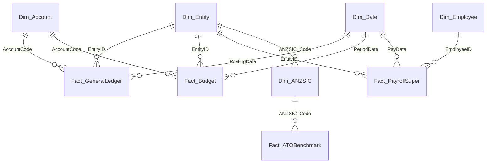

# Australian Accounting Power BI

> [!IMPORTANT]
> **Repository migration: 3 September 2026.** We moved maintained development to
> [`apps/australian-accounting-power-bi`](https://github.com/ryanduguid/accounting-review-pipeline/tree/main/apps/australian-accounting-power-bi)
> in Accounting Review Pipeline.
> Use the shared
> [`Xero trial-balance contract`](https://github.com/ryanduguid/accounting-review-pipeline/tree/main/contracts/xero-trial-balance-v1).
>
> This repository has no rollback release, so it remains the authoritative
> fallback until the fourteen-day observation window closes on
> 17 September 2026. Open new issues and pull requests in Accounting Review Pipeline.

[](https://github.com/ryanduguid/australian-accounting-power-bi/actions/workflows/verify.yml) [](LICENSE)

**Status: incubating.** This source-controlled Power BI Project (`.pbip`) is an evolving reference implementation, not a production-ready Power BI solution. It demonstrates Australian accounting domain modelling, dimensional star schema design, Tabular Model Definition Language (TMDL), calculation groups, and automated GitHub Actions CI verification.

---

## What This Project Solves

Most Power BI repositories on GitHub commit monolithic binary `.pbix` blobs with zero diffability, no automated test suites, and generic mock sales data.

This project treats Power BI as source-controlled software engineering:
1. **Plain-Text Version Control**: Built entirely on the Power BI Project format (`.pbip`), using Tabular Model Definition Language (`.tmdl`) and Enhanced Report Format (`.pbir`). Measures, visuals, relationships, and M expressions produce reviewable git diffs.
2. **Multi-Entity Consolidation & Financial Statements**: P&L matrix reporting and balance sheet measures across a multi-entity corporate group (operating company, trading subsidiary, logistics entity, property trust) with automated intercompany transaction eliminations.
3. **ATO Small Business Benchmarks Diagnostic**: Ingests ANZSIC industry classifications and scores business cost structures against the Australian Taxation Office's published small business benchmark ranges for the relevant industry, averaged across that industry's published turnover bands.
4. **Live Payday Super Compliance Monitoring**: Tracks Single Touch Payroll Phase 2 events (Code Q - Qualifying Earnings, Code L - Super Liability at 12.0%) against the statutory 7-business-day fund receipt rule commencing 1 July 2026, including automated SG charge and notional earnings exposure calculators.

---

## Data Model Architecture (Star Schema)



See [docs/data-model.md](docs/data-model.md) for table grain, schema descriptions, and dimension attributes.

---

## Report Structure (4 Pages)

1. **Executive Financial Performance**: Consolidated P&L matrix with revenue, gross margin, EBITDA, and net asset cards, and a cumulative working capital trend.
2. **Multi-Entity Consolidation & Eliminations**: Entity-level matrix views with automated intra-group elimination columns and intercompany loan audit trails.
3. **ATO Benchmark & Practice Diagnostic**: ANZSIC industry quantile comparisons, gross margin and cost ratio variance analyses, and an automated benchmark variance rating.
4. **Payday Super & STP Compliance Monitor**: 7-business-day timeline tracker, clearing-house transit risk analyser, and estimated Super Guarantee Charge (SGC) exposure calculators.

---

## Calculation Groups & Advanced DAX

The semantic model uses calculation groups to dynamically apply time intelligence and consolidation filters across any base measure without measure proliferation:

- **`CalcGroup_TimeIntelligence`**: Supports Base Period, MTD, QTD, FYTD (1 July to 30 June Australian financial year), Prior Year (PY), YoY Variance (\$), and YoY Variance (%).
- **`CalcGroup_Consolidation`**: Supports Gross Group Total, Intercompany Eliminations, and Consolidated Group Net.

See [docs/dax-patterns.md](docs/dax-patterns.md) for full DAX formulas and precedence rules.

---

## Repository Layout

```text
australian-accounting-power-bi/
├── .github/
│   └── workflows/
│       └── verify.yml                   # CI: TMDL schema validation & fixture balance check
├── docs/
│   ├── data-model.md                    # Star schema diagram & dimension specifications
│   ├── dax-patterns.md                  # Calculation groups & financial statement DAX
│   └── compliance-methodology.md        # Australian tax & Payday Super calculation rules
├── australian-accounting-power-bi.pbip  # Power BI Project root descriptor
├── australian-accounting-power-bi.Report/ # Enhanced Report Format (PBIR)
│   ├── .platform                         # Fabric item metadata
│   ├── definition.pbir
│   └── definition/
│       ├── version.json
│       ├── report.json                  # Report settings and base theme
│       └── pages/                       # Four pages and 21 source-controlled visuals
├── australian-accounting-power-bi.SemanticModel/ # Tabular Model Definition Language (TMDL)
│   ├── definition.pbism                 # Semantic model descriptor
│   └── definition/
│       ├── database.tmdl                # Database compatibility and language
│       ├── model.tmdl                   # Canonical table and expression references
│       ├── relationships.tmdl           # Unidirectional star schema relationships
│       ├── expressions.tmdl             # Eight named Power Query (M) expressions
│       └── tables/                      # Dimensions, facts, and calculation groups
├── samples/                             # Deterministic fabricated CSV fixtures
│   ├── sample-entities.csv              # Varrock Ventures, Draynor Produce, Falador Freight
│   ├── sample-chart-of-accounts.csv     # Standard Australian Chart of Accounts
│   ├── sample-general-ledger.csv        # Balanced double-entry GL journals (FY25-FY27)
│   ├── sample-budgets.csv               # Monthly departmental budgets
│   ├── sample-payroll-super.csv         # Payday Super events with on-time & late receipts
│   └── sample-ato-benchmarks.csv        # Real ATO benchmark percentiles by ANZSIC category
├── tests/
│   ├── test_fixtures_balance.py         # Asserts debits == credits per journal and period
│   ├── test_tmdl_integrity.py           # Asserts TMDL syntax, explicit measure formats, descriptions
│   ├── test_powerquery_m.py             # Validates embedded Power Query M and fixture widths
│   ├── test_pbip_structure.py           # Validates PBIP layout and report-to-model bindings
│   ├── test_payday_super_rules.py       # Verifies Payday Super 7-business-day statutory rules
│   └── model_bpa_rules.json             # Tabular Model Best Practice Analyzer ruleset
├── tools/
│   └── generate_fixtures.py             # Script to deterministically generate all synthetic test data
├── LICENSE                              # MIT License
├── DISCLAIMER.md                        # Professional disclaimer
├── CONTRIBUTING.md                      # Contribution guidelines
└── SECURITY.md                          # Security policy
```

---

## Verification & Automated Testing

Run the test suite locally:

```bash
python -B -m unittest discover -s tests -v
```

With Node.js 24 available, run Microsoft's pinned PBIR validator:

```bash
npx --yes @microsoft/powerbi-report-authoring-cli@0.1.4 validate australian-accounting-power-bi.Report
```

The test suite verifies:
- Every journal in `sample-general-ledger.csv` balances to zero (debits equal credits).
- Intercompany entries balance to zero across the group.
- The committed fixtures regenerate byte-for-byte from `tools/generate_fixtures.py`, and every sample ABN passes the statutory modulus-89 checksum.
- Every relationship the ER diagrams document exists, and `Dim_ANZSIC` declares every industry code the entity and benchmark fixtures join on.
- Every DAX measure uses supported `///` description syntax, and every numeric measure has an explicit format string.
- All relationships enforce strict single-direction star schema filtering.
- All eight named Power Query expressions use balanced `let ... in` blocks, valid fixture widths, and valid ABN algorithm weights.
- The semantic model uses the supported TMDL folder contract and resolves every import partition.
- All four report pages and 21 visuals are materialised, and every visual field binding resolves to a declared model column or measure.
- Payday Super tests assert 12.0% SG rate, 7-business-day national calendar calculation, and leap year GIC divisors (366 days in leap years per s 8AAD TAA).

GitHub Actions runs both the Python suite and the pinned Microsoft PBIR validator.

---

## Opening the Project

1. Open `australian-accounting-power-bi.pbip` in **Power BI Desktop** (Developer Mode enabled).
2. Or inspect and edit the semantic model directly in **Tabular Editor 3 / 2** by opening the `australian-accounting-power-bi.SemanticModel` directory.
3. Or view and edit TMDL files in **Visual Studio Code** using the Microsoft TMDL extension.

Automated checks validate the source structure and bindings, but they do not refresh the model or render the report in Power BI Desktop. Complete that native smoke test before treating a release as production-ready.

---

## Disclaimer

Utility code, MIT-licensed, no warranty. Nothing here constitutes tax, financial, or legal advice. Outputs and calculations require independent professional review. All sample data is fabricated using synthetic entities.

---

## Author

Ryan Duguid, accountant in Newcastle NSW, provisional member of Chartered Accountants ANZ.
