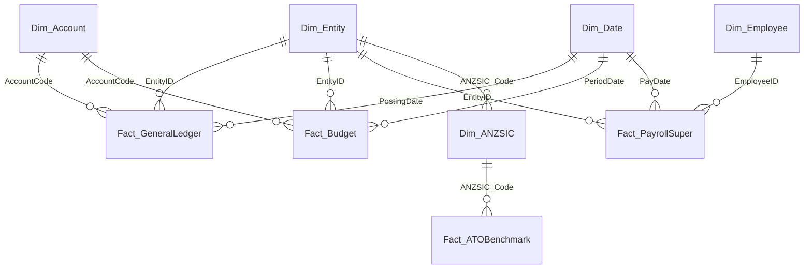

# Dimensional Data Model Architecture

The semantic model follows Kimball star schema principles, strictly separating dimension tables from fact tables with unidirectional `1:*` relationships to ensure optimal DAX performance and unambiguous filter propagation.

---

## 1. Dimension Tables

### `Dim_Date` (Australian Financial Year Calendar)
- **Primary Key**: `Date`
- **Granularity**: One row per calendar day (1 July 2024 to 30 June 2027).
- **Core Attributes**:
  - `CalendarYear`, `MonthNumber`, `MonthName`, `DayOfMonth`, `DayOfWeek`, `DayName`.
  - `FinancialYear`: Australian financial year label (e.g. `FY24-25`, `FY25-26`, `FY26-27`).
  - `FinancialQuarter`: `FQ1` (Jul-Sep), `FQ2` (Oct-Dec), `FQ3` (Jan-Mar), `FQ4` (Apr-Jun).
  - `FinancialMonthNumber`: `1` (July) through `12` (June).
  - `FYStartDate`, `FYEndDate`: Standard financial period boundaries.

### `Dim_Entity` (Multi-Entity Corporate Hierarchy)
- **Primary Key**: `EntityID`
- **Granularity**: One row per legal entity in the corporate group.
- **Attributes**: `LegalName`, `TradingName`, `ABN`, `ACN`, `TaxStructure` (Company vs Unit Trust), `EntityRole`, `ANZSIC_Code`, `Currency`, `ConsolidationWeight`.

### `Dim_Account` (Chart of Accounts & Financial Reporting)
- **Primary Key**: `AccountCode`
- **Granularity**: One row per general ledger account.
- **Attributes**: `AccountName`, `Class` (Asset, Liability, Equity, Revenue, Expense), `SubClass`, `ReportSection` (Balance Sheet vs Profit and Loss), `BalanceSheetGroup`, `CashFlowCategory` (Operating, Investing, Financing), `NormalBalance` (Debit/Credit), `SortOrder`.

### `Dim_ANZSIC` (Industry Classifications)
- **Primary Key**: `ANZSIC_Code`
- **Granularity**: One row per Australian and New Zealand Standard Industrial Classification 4-digit code.
- **Attributes**: `Division`, `Subdivision`, `IndustryTitle`.

### `Dim_Employee` (Synthetic Workforce Master)
- **Primary Key**: `EmployeeID`
- **Granularity**: One row per employee.
- **Attributes**: `EntityID`, `EmployeeName`, `SuperFundUSI`, `SuperFundName`.

---

## 2. Fact Tables

### `Fact_GeneralLedger`
- **Granularity**: Individual double-entry journal lines.
- **Foreign Keys**: `PostingDate` -> `Dim_Date[Date]`, `EntityID` -> `Dim_Entity[EntityID]`, `AccountCode` -> `Dim_Account[AccountCode]`.
- **Measures / Metrics**: `Debit`, `Credit`, `Amount` (Net signed amount), `IntercompanyEntityID`, `IsIntercompany` (Boolean flag enabling automated consolidation eliminations).

### `Fact_Budget`
- **Granularity**: Monthly departmental financial budget per account.
- **Foreign Keys**: `PeriodDate` -> `Dim_Date[Date]`, `EntityID` -> `Dim_Entity[EntityID]`, `AccountCode` -> `Dim_Account[AccountCode]`.
- **Metrics**: `BudgetAmount`.

### `Fact_PayrollSuper`
- **Granularity**: Individual employee Single Touch Payroll (STP Phase 2) pay run events.
- **Foreign Keys**: `PayDate` -> `Dim_Date[Date]`, `EntityID` -> `Dim_Entity[EntityID]`, `EmployeeID` -> `Dim_Employee[EmployeeID]`.
- **Metrics**: `GrossEarnings`, `QualifyingEarnings_CodeQ`, `SuperLiability_CodeL` (12.0%), `RemittanceDate`, `FundReceiptDate`, `StatutoryDueDate` (7 national business days from payday), `ComplianceStatus`, `SGC_Shortfall`, `GIC_NominalInterest`.

### `Fact_ATOBenchmark`
- **Granularity**: ATO small business benchmark percentiles by ANZSIC code and turnover bracket.
- **Foreign Keys**: `ANZSIC_Code` -> `Dim_ANZSIC[ANZSIC_Code]`.
- **Metrics**: `GrossProfitPct_Low`, `GrossProfitPct_Avg`, `GrossProfitPct_High`, `TotalExpensesPct_Avg`, `RentPct_Avg`, `MotorVehiclePct_Avg`, `LabourPct_Avg`.
